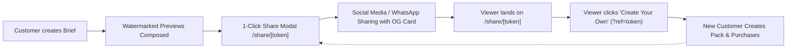

# GDP Distribution Loop & Cohort Measurement Protocol (D-05)

## 1. Executive Summary & Viral Loop Mechanics

The GDP platform is engineered around an organic distribution loop:


When a user shares a concept:
1. A unique share token is generated (`/api/packs/:id/share`).
2. The recipient accesses `/share/:token`, which renders full OpenGraph metadata (`og:image`, `og:title`, `og:description`, Twitter Card).
3. The viral CTA redirects the viewer to `/?ref=:token`.
4. The brief intake engine carries forward `ref` and any `utm_*` tracking tags into `analytics_events`.
5. If the recipient converts, a `referral_purchase` event is logged linking back to the originating share token.

---

## 2. Mathematical Modeling & Metrics

### 2.1 Viral K-Factor
The K-Factor measures whether each customer generates more than one subsequent customer:
$$K = i \times c$$
Where:
- $i$ = Number of invites/shares generated per paying customer ($N_{\text{shares}} / N_{\text{customers}}$).
- $c$ = Conversion rate of each share view into a paying customer ($N_{\text{referral\_purchases}} / N_{\text{shares}}$).

**Equivalent Formulation:**
$$K = \frac{\text{Total Referral Purchases}}{\text{Total Direct Purchases}}$$

- **$K \ge 1.0$**: **True Virality / Exponential Growth**. Every cohort produces more customers than itself without paid marketing.
- **$0.3 \le K < 1.0$**: **Viral Multiplier**. Paid acquisition cost (CAC) is discounted by $\frac{1}{1 - K}$. (e.g., $K = 0.5$ implies a $2\times$ amplifier on customer acquisition).
- **$K < 0.3$**: **Linear Growth**. Customer acquisition remains largely dependent on direct/paid channels.

### 2.2 Viral Cycle Time ($ct$)
The average time (in hours) between a share link being generated and a referral purchase completing:
$$\overline{ct} = \frac{1}{N} \sum_{j=1}^{N} (t_{\text{referral\_purchase}} - t_{\text{share\_created}})$$
Shorter cycle times (< 24 hours) accelerate compounding growth across cohorts.

### 2.3 Cohort Analysis
Users are bucketed into calendar weeks (e.g., `2026-W37`). Each cohort tracks:
- New Users Acquired ($N$)
- Packs Created
- Total Purchases
- Preview-to-Purchase Conversion Rate (%)
- Viral K-Factor
- Acquisition Channel Split (`direct`, `referral`, `google`, `facebook`, `whatsapp`, etc.)

---

## 3. Analytics Event Taxonomy

All events are recorded in PostgreSQL `analytics_events` and mirrored in memory:

| Event Name | Trigger Location | Mandatory Payload Keys |
| :--- | :--- | :--- |
| `brief_started` | Landing page form submit | `title`, `utmSource`, `referralToken` |
| `preview_viewed` | Concept preview displayed | `packId`, `vqsScores`, `conceptCount` |
| `share_created` | Share link generated | `packId`, `conceptId`, `token` |
| `share_viewed` | `/share/[token]` viewed | `packId`, `conceptId`, `token` |
| `checkout_started` | Payment modal opened | `packId`, `orderId`, `productId`, `amount` |
| `payment_succeeded` | Gateway confirmation | `orderId`, `packId`, `amount`, `currency` |
| `referral_purchase` | Webhook / checkout with `ref` | `referralToken`, `orderId`, `packId` |

---

## 4. Operational Reporting & Monitoring

### CLI Cohort Summary
```bash
npx tsx scripts/distribution-report.ts
```

### Admin REST Endpoint
```http
GET /api/admin/analytics/cohorts
Headers:
  Authorization: Bearer <VISION_SERVICE_SECRET>
```

---

## 5. Real-World Validation Boundary

> [!IMPORTANT]
> - **Code-Verified**: Event logging, OpenGraph preview tags, share token attribution, K-factor math, and weekly cohort aggregation are verified via automated tests.
> - **Real-World Validation (Pending)**: Proving that $K > 1.0$ in the wild requires active marketing campaigns, genuine user shares on WhatsApp/Instagram, and empirical cohort tracking over several weeks.
