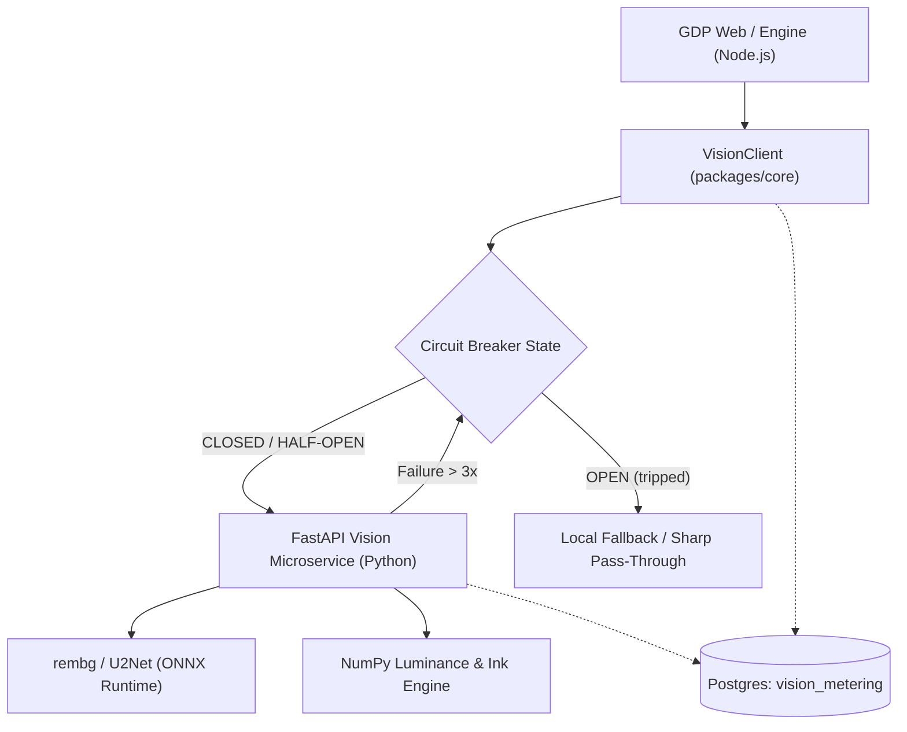

# FastAPI Vision Microservice Architecture & COGS Model (D-17)

## 1. Context & Motivation

In promotional graphic design (e.g. church posters, product launches, event flyers), subject imagery frequently requires:
1. **Background Cutouts**: Segmenting human pastors, musical artists, or physical products from busy camera backgrounds.
2. **Visual Density & Balance**: Measuring non-ink background area, ink coverage ratios, and visual center of mass to enforce quality gating.

Performing neural network segmentation (U2Net, BiRefNet) inside a Node.js V8 process incurs significant memory pressure and native add-on instability. Meanwhile, relying on commercial third-party APIs (e.g., Replicate, Fal.ai, remove.bg) introduces:
- **Prohibitive COGS**: $0.02 to $0.20 per call. For a $2.99 pack generating 3 concept options, vision APIs consume up to $0.60 (20–25% of gross revenue).
- **Latency & Reliability Risks**: External cloud network round-trips (1,500ms – 4,000ms).

Decision **D-17** establishes a dedicated, internal Python FastAPI microservice (`services/vision`) running U2Net on self-hosted compute, invoked via an HMAC-authenticated client with circuit breaker fallback.

---

## 2. Microservice Architecture



---

## 3. API Contract & Endpoints

### 3.1 `POST /v1/cutout/json`
Accepts a base64 encoded image and returns a transparent PNG cutout with subject bounding box:
```json
// Request
{
  "image_base64": "data:image/jpeg;base64,...",
  "pack_id": "pck_123"
}

// Response (200 OK)
{
  "image_base64": "data:image/png;base64,...",
  "width": 1080,
  "height": 1080,
  "latency_ms": 142.5,
  "subject_box": [120, 85, 940, 1020]
}
```

### 3.2 `POST /v1/analyze`
Computes ink coverage, density ratio, and visual center of mass:
```json
// Response (200 OK)
{
  "width": 1080,
  "height": 1080,
  "ink_coverage": 0.245,
  "density_ratio": 0.6125,
  "visual_balance": {
    "center_of_mass_x": 0.495,
    "center_of_mass_y": 0.512,
    "horizontal_skew": -0.005,
    "vertical_skew": 0.012
  },
  "latency_ms": 18.2
}
```

---

## 4. Resilience & Circuit Breaker Specification

The `VisionCircuitBreaker` in `packages/core/src/vision-client.ts` implements standard three-state fault tolerance:
1. **CLOSED**: Normal operation. Requests flow to the FastAPI service.
2. **OPEN**: If 3 consecutive requests fail (timeout, 5xx, connection refused), the breaker trips. All subsequent calls bypass the network and return instant local fallbacks (`latencyMs: 1`, `provider: "circuit_breaker_open"`).
3. **HALF_OPEN**: After a 30-second cooldown, one probe request is allowed through. A successful probe closes the breaker; a failed probe resets the 30-second timer.

---

## 5. HMAC Authentication

Requests between the Node.js application and the Vision microservice are signed using HMAC-SHA256:
- Secret: `VISION_SERVICE_SECRET`.
- Header: `X-GDP-Signature: <hex_digest>`.
- FastAPI verifies incoming raw byte streams using constant-time `hmac.compare_digest`.

---

## 6. Unit Economics & COGS Comparison

| Architecture | Model | Cost per Image | Cost per Pack (3 concepts) | % of $2.99 Gross |
| :--- | :--- | :--- | :--- | :--- |
| **Hosted API (Commercial)** | Remove.bg / Replicate | $0.025 – $0.050 | $0.075 – $0.150 | 2.5% – 5.0% |
| **GDP FastAPI (Self-Hosted)** | U2Net on 2vCPU / GPU | **$0.0004** | **$0.0012** | **< 0.05%** |

Every call is logged to `vision_metering`. Real-time audit reports are generated via:
```bash
npx tsx scripts/vision-cogs-report.ts
```

---

## 7. Real-World Validation Boundary

> [!IMPORTANT]
> - **Code-Verified**: The FastAPI routes, Pydantic schemas, Dockerfile, TypeScript client with circuit breaker, HMAC signing, and PostgreSQL metering schema are verified in automated test suites.
> - **Real-World Validation (Pending)**: Real-world high-throughput GPU inference benchmarking, U2Net edge sharpness across diverse lighting/skin tones, and production Kubernetes deployment require live infrastructure provisioning.
